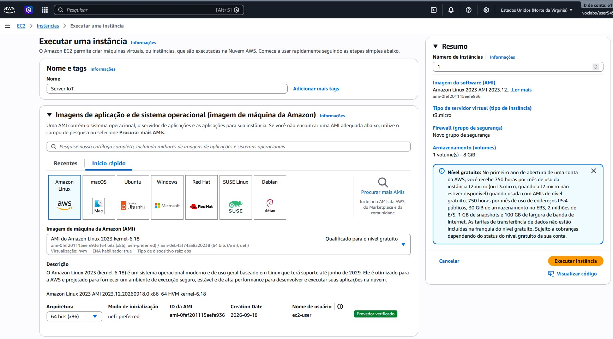
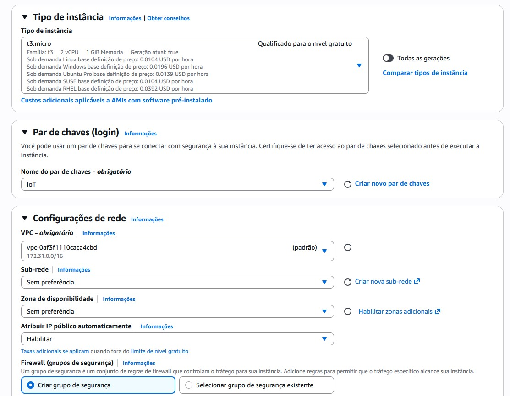
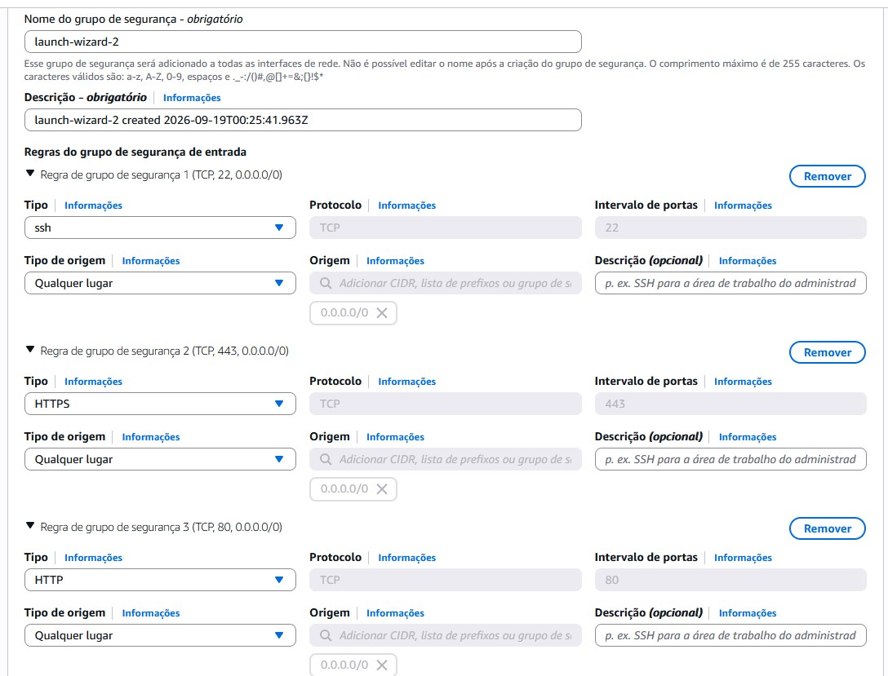
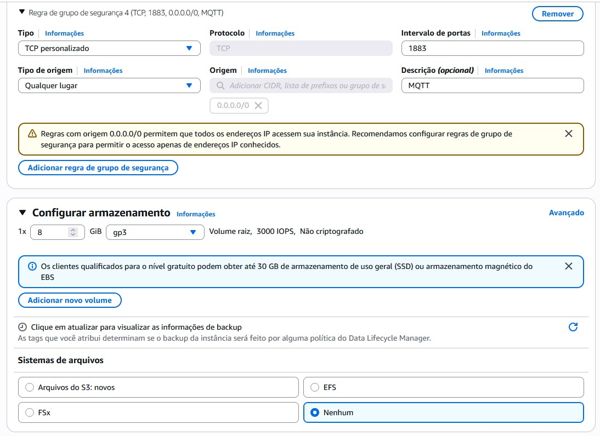

# Guia Prático: Criação e Configuração de Instância EC2 na AWS

Este documento apresenta o passo a passo detalhado e explicado para a criação e provisionamento de uma máquina virtual no **Amazon EC2 (Elastic Compute Cloud)**, configurada especificamente para hospedar o ecossistema de automação industrial e IIoT deste projeto (Simulador Flask, Eclipse Mosquitto MQTT e Node-RED).

---

## Sumário
1. [Visão Geral e Arquitetura](#1-visão-geral-e-arquitetura)
2. [Passo a Passo de Configuração](#2-passo-a-passo-de-configuração)
   - [Etapa 1: Nome e Imagem do Sistema Operacional (AMI)](#etapa-1-nome-e-imagem-do-sistema-operacional-ami)
   - [Etapa 2: Tipo de Instância e Par de Chaves](#etapa-2-tipo-de-instância-e-par-de-chaves)
   - [Etapa 3: Configurações de Rede](#etapa-3-configurações-de-rede)
   - [Etapa 4: Firewall e Grupo de Segurança (Security Group)](#etapa-4-firewall-e-grupo-de-segurança-security-group)
   - [Etapa 5: Armazenamento (EBS)](#etapa-5-armazenamento-ebs)
   - [Etapa 6: Revisão e Lançamento](#etapa-6-revisão-e-lançamento)
3. [Tabela Resumo das Configurações](#3-tabela-resumo-das-configurações)
4. [Pós-Criação: Como Conectar e Preparar o Servidor](#4-pós-criação-como-conectar-e-preparar-o-servidor)

---

## 1. Visão Geral e Arquitetura

Para executar a aplicação de automação conteinerizada em nuvem, foi dimensionada uma instância compatível com o **Nível Gratuito (AWS Free Tier)** na região de **Norte da Virgínia (`us-east-1`)**.

A instância executa o sistema operacional **Amazon Linux 2023** e expõe as portas necessárias para que tanto os operadores industriais quanto os dispositivos e sensores IoT possam interagir com os serviços:

```
                  ┌──────────────────────────────────────────────┐
                  │          AWS EC2 ("Server IoT")             │
                  │   IP Público Dinâmico (IPv4 Habilitado)     │
                  │                                              │
  SSH (Porta 22)  │  Terminal Administrativo (ec2-user)          │
 ───────────────► │                                              │
                  │  ┌────────────────────────────────────────┐  │
  HTTP (Porta 80) │  │  Simulador SCADA / API Flask           │  │
 ───────────────► │  └────────────────────────────────────────┘  │
                  │  ┌────────────────────────────────────────┐  │
 HTTP (Porta 443) │  │  Node-RED (Fluxos de Automação)        │  │
 ───────────────► │  └────────────────────────────────────────┘  │
                  │  ┌────────────────────────────────────────┐  │
 MQTT (Porta 1883)│  │  Eclipse Mosquitto (Broker MQTT)       │  │
 ───────────────► │  └────────────────────────────────────────┘  │
                  └──────────────────────────────────────────────┘
```

---

## 2. Passo a Passo de Configuração

Acesse o console da AWS, entre no serviço **EC2** e clique no botão laranja **"Executar instância"** (*Launch Instance*).

---

### Etapa 1: Nome e Imagem do Sistema Operacional (AMI)



1. **Nome da Instância:**
   - **Campo:** `Nome`
   - **Valor utilizado:** `Server IoT`
   - *Explicação:* Identifica facilmente a finalidade do servidor dentro da lista de instâncias da conta.

2. **Imagens de aplicação e de sistema operacional (AMI - Amazon Machine Image):**
   - **Distribuição:** `Amazon Linux`
   - **AMI selecionada:** `Amazon Linux 2023 AMI` (versão kernel 6.18, arquitetura `64 bits (x86)`)
   - **ID da AMI:** `ami-0fef201115eefe936`
   - **Usuário padrão de login:** `ec2-user`
   - *Explicação:* O Amazon Linux 2023 é a distribuição oficial da AWS otimizada para alto desempenho, segurança e integração nativa com os serviços da nuvem, contando com suporte de longo prazo e 100% qualificada para o **Nível Gratuito**.

---

### Etapa 2: Tipo de Instância e Par de Chaves



1. **Tipo de Instância:**
   - **Tipo:** `t3.micro`
   - **Hardware:** 2 vCPUs, 1 GiB de Memória RAM.
   - *Explicação:* A família `t3` oferece desempenho com capacidade de burst de CPU. Em regiões onde a `t2.micro` não é o padrão ou para contas modernas, a `t3.micro` é coberta pelo Free Tier (até 750 horas/mês no primeiro ano). Oferece recursos suficientes para rodar os 3 contêineres Docker leves do projeto.

2. **Par de chaves (login via SSH):**
   - **Nome do par de chaves:** `IoT`
   - *Explicação:* O par de chaves criptográficas é o método mais seguro de autenticação. O console gera/utiliza uma chave privada (`IoT.pem`) que deve ser guardada com segurança na sua máquina local para autorizar conexões SSH.

> [!WARNING]
> Nunca compartilhe seu arquivo `.pem` nem o versione em repositórios públicos do GitHub.

---

### Etapa 3: Configurações de Rede

Ainda na seção de rede (ilustrada em `ec2_02.jpg`):

1. **VPC:** Utilizada a VPC padrão (`vpc-0af3f1110caca4cbd (padrão) 172.31.0.0/16`).
2. **Sub-rede:** `Sem preferência` (a AWS seleciona automaticamente uma zona de disponibilidade saudável).
3. **Atribuir IP público automaticamente:** **`Habilitar`** (Mandatório).
   - *Por que habilitar?* Como precisaremos acessar a API na porta 80, o Node-RED na 443 e conectar dispositivos remotos ao Broker MQTT na 1883, a instância precisa obrigatoriamente de um endereço IPv4 público roteável na Internet.

---

### Etapa 4: Firewall e Grupo de Segurança (Security Group)

O **Security Group** atua como um firewall virtual a nível de instância, controlando o tráfego de entrada (*Inbound*) e saída (*Outbound*).

- **Ação:** `Criar grupo de segurança`
- **Nome sugerido na tela:** `launch-wizard-2`

#### Regras de Entrada Configuradas:

As regras foram configuradas nas telas `ec2_03.jpg` e `ec2_04.jpg`:




| Regra | Tipo | Protocolo | Porta | Origem | Finalidade no Projeto |
| :---: | :---: | :---: | :---: | :---: | :--- |
| **1** | `SSH` | TCP | `22` | `0.0.0.0/0` (Qualquer lugar) | Acesso remoto administrativo via terminal/linha de comando. |
| **2** | `HTTPS` | TCP | `443` | `0.0.0.0/0` (Qualquer lugar) | Acesso à interface visual de fluxos do **Node-RED**. |
| **3** | `HTTP` | TCP | `80` | `0.0.0.0/0` (Qualquer lugar) | Acesso ao **Simulador Industrial SCADA** e **API Flask**. |
| **4** | `TCP personalizado` | TCP | `1883` | `0.0.0.0/0` (Qualquer lugar) | Porta de telemetria do broker **Eclipse Mosquitto (MQTT)**. |

> [!IMPORTANT]
> **Boas Práticas de Segurança:**
> A origem `0.0.0.0/0` permite conexões de qualquer endereço IP da Internet. Para a porta `22 (SSH)`, o recomendado para ambientes de produção corporativos é restringir para `Meu IP` (*My IP*). No entanto, para laboratórios acadêmicos onde o aluno acessa de diferentes redes (faculdade, casa, 4G), a regra aberta facilita o acesso contínuo.

---

### Etapa 5: Armazenamento (EBS)

Configurado na parte inferior da tela `ec2_04.jpg`:

1. **Volume Raiz:** `1x 8 GiB`
2. **Tipo de Volume:** `gp3` (General Purpose SSD)
3. **Performance:** 3000 IOPS de linha de base e throughput estável, sem custos adicionais sobre o tipo gp2.
4. **Sistemas de arquivos adicionais:** `Nenhum`
5. *Explicação:* O volume de 8 GiB é o tamanho mínimo padrão do Amazon Linux 2023 e é mais do que suficiente para o sistema operacional, Docker e as imagens dos 3 contêineres. O AWS Free Tier permite até 30 GiB mensais somados de volumes EBS.

---

### Etapa 6: Revisão e Lançamento

No painel lateral direito de **Resumo**:
- Quantidade: `1` instância
- AMI: `Amazon Linux 2023 AMI`
- Tipo: `t3.micro`
- Firewall: `Novo grupo de segurança`
- Armazenamento: `1 volume de 8 GiB (gp3)`

Clique no botão laranja **"Executar instância"** (*Launch instance*). Em cerca de 1 a 2 minutos a máquina passará do estado `Pendente` para `Em execução` (*Running*).

---

## 3. Tabela Resumo das Configurações

| Parâmetro | Valor Configurado | Justificativa / Observação |
| :--- | :--- | :--- |
| **Nome** | `Server IoT` | Identificação amigável |
| **Região AWS** | `us-east-1` (N. Virgínia) | Região de menor latência e maior disponibilidade |
| **Sistema Operacional (AMI)** | Amazon Linux 2023 (kernel 6.18) | Otimizado para AWS, 64-bit x86 |
| **Tipo de Instância** | `t3.micro` (2 vCPU, 1 GiB RAM) | Coberto pelo Nível Gratuito (Free Tier) |
| **Par de Chaves** | `IoT` | Autenticação SSH segura via `IoT.pem` |
| **VPC / Sub-rede** | Padrão / Sem preferência | Roteamento automático da AWS |
| **IP Público IPv4** | Habilitado | Permite acesso externo à API, Node-RED e MQTT |
| **Portas Abertas (Inbound)** | `22`, `80`, `443`, `1883` | SSH, SCADA/API, Node-RED e MQTT Broker |
| **Disco EBS** | 8 GiB SSD `gp3` | Volume raiz do sistema operacional |

---

## 4. Pós-Criação: Como Conectar e Preparar o Servidor

Após a inicialização da instância no console da AWS:

### 1. Obter o IP Público
Copie o **Endereço IPv4 público** exibido na aba de detalhes da sua instância no painel EC2 (exemplo: `54.234.10.20`).

### 2. Conectar via SSH

Abra o terminal (PowerShell, Git Bash ou Linux/Mac) na pasta onde está o arquivo `IoT.pem`:

```bash
# No Linux ou macOS (ajuste de permissões obrigatório):
chmod 400 IoT.pem

# Comando de conexão:
ssh -i "IoT.pem" ec2-user@<IP_PUBLICO_DA_SUA_EC2>
```

*(Substitua `<IP_PUBLICO_DA_SUA_EC2>` pelo IP real da sua máquina)*

### 3. Instalar Docker, Docker Compose e Buildx na EC2

Uma vez conectado no terminal do Amazon Linux, execute os blocos de comandos abaixo:

#### A) Instalação e Inicialização do Docker

```bash
# Atualizar os pacotes do sistema operacional
sudo yum update -y

# Instalar o motor do Docker
sudo yum install docker -y

# Habilitar o serviço do Docker para inicialização automática no boot
sudo systemctl enable docker.service

# Iniciar o serviço do Docker
sudo systemctl start docker.service

# Adicionar o usuário atual ao grupo docker (permite executar comandos sem sudo)
sudo usermod -aG docker $USER

# Aplicar imediatamente as permissões de grupo na sessão atual
newgrp docker
```

#### B) Instalação do Docker Compose Plugin

```bash
# Criar diretório para plugins de CLI do Docker
sudo mkdir -p /usr/local/lib/docker/cli-plugins

# Baixar o binário oficial do Docker Compose v2
sudo curl -SL https://github.com/docker/compose/releases/latest/download/docker-compose-linux-x86_64 \
  -o /usr/local/lib/docker/cli-plugins/docker-compose

# Conceder permissão de execução ao binário
sudo chmod +x /usr/local/lib/docker/cli-plugins/docker-compose

# Validar a versão instalada do Docker Compose
docker compose version
```

#### C) Instalação do Docker Buildx Plugin

```bash
# Remover versões anteriores do plugin (se existirem)
sudo rm -f /usr/local/lib/docker/cli-plugins/docker-buildx

# Baixar o binário oficial do plugin Docker Buildx
sudo curl -fL \
  https://github.com/docker/buildx/releases/download/v0.17.1/buildx-v0.17.1.linux-amd64 \
  -o /usr/local/lib/docker/cli-plugins/docker-buildx

# Conceder permissão de execução ao binário
sudo chmod +x /usr/local/lib/docker/cli-plugins/docker-buildx

# Validar a versão instalada do Docker Buildx
docker buildx version
```

### 4. Clonar e Subir a Aplicação

```bash
# 1. Instalar git (se necessário)
sudo yum install git -y

# 2. Clonar o repositório da disciplina
git clone https://github.com/profAndreSouza/api_automacao.git
cd api_automacao

# Subir os 3 contêineres em segundo plano
docker compose up --build -d
```

### 5. Acessando os Serviços em Nuvem

Com os contêineres em execução, teste o acesso pelo navegador web do seu computador:

- **Painel SCADA / API Flask:** `http://<IP_PUBLICO_DA_SUA_EC2>` (porta 80 padrão)
- **Painel de Fluxos Node-RED:** `http://<IP_PUBLICO_DA_SUA_EC2>:443`
- **Broker MQTT Mosquitto:** `<IP_PUBLICO_DA_SUA_EC2>:1883` (para clientes MQTT, ESP32, Node-RED ou Python)
